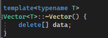

# Airidas
## v0.4
## Kompiuterio parametrai
AMD Ryzen 7 5700G  
WDC PC SN530 SSD  
NVIDIA GeForce RTX 3060 Ti  
### Testavimas vyko su:
1tūkst. studentų  
10tūkst. studentų  
100tūkst. studentų  
1mil. studentų  
10mil. studentų  

## 1 Testas (Failų kūrimas ir jų uždarymas)   
1000 įrašų failo generacija užtruko 0.0060138 s   
10000 įrašų failo generacija užtruko 0.0418468 s   
100000 įrašų failo generacija užtruko 0.45358 s   
1000000 įrašų failo generacija užtruko 4.84666 s   
10000000 įrašų failo generacija užtruko 45.4129 s   
   
## 2 Testas (Duomenu apdorojimas)   
### Duomenu nuskaitymas is failo   
1000 įrašų failo nuskaitymas užtruko 0.0390084 s   
10000 įrašų failo nuskaitymas užtruko 0.42876 s   
100000 įrašų failo nuskaitymas užtruko 4.22791 s   
1000000 įrašų failo nuskaitymas užtruko 42.3082 s   
10000000 įrašų failo nuskaitymas užtruko 427.19 s   
### Studentų rūšiavimas į dvi grupes   
1000 studentų rūšiavimas užtruko 0s.   
10000 studentų rūšiavimas užtruko 0.0030001 s.   
100000 studentų rūšiavimas užtruko 0.0310067 s.   
1000000 studentų rūšiavimas užtruko 0.298552 s.   
10000000 studentų rūšiavimas užtruko 2.96067 s.   
### Studentų išvedimas į du naujus failus   
   
#### Studentų rūšiavimas į gerus   
Geri studentai isvesti i faila Geri_studentai.txt   
Tai uztruko: 0.0040007 s   
Geri studentai isvesti i faila Geri_studentai.txt   
Tai uztruko: 0.0300068 s   
Geri studentai isvesti i faila Geri_studentai.txt   
Tai uztruko: 0.302068 s   
Geri studentai isvesti i faila Geri_studentai.txt   
Tai uztruko: 3.09814 s   
Geri studentai isvesti i faila Geri_studentai.txt   
Tai uztruko: 30.6174 s   
#### Studentų rūšiavimas į blogus   
Blogi studentai isvesti i faila Blogi_studentai.txt   
Tai uztruko: 0.0010003 s   
Blogi studentai isvesti i faila Blogi_studentai.txt   
Tai uztruko: 0.0070016 s   
Blogi studentai isvesti i faila Blogi_studentai.txt   
Tai uztruko: 0.0760182 s   
Blogi studentai isvesti i faila Blogi_studentai.txt   
Tai uztruko: 0.829187 s   
Blogi studentai isvesti i faila Blogi_studentai.txt   
Tai uztruko: 8.09913 s   
   
## v 1.0   
## NUSKAITYMAS   
   
### Duomenų nuskaitymas iš failo (vector)   
1000 studentų - 0.0494249 s.   
10000 studentų - 0.46234 s.   
100000 studentų - 3.90874 s.   
1000000 studentų - 41.7636 s.   
10000000 studentų - 411.602 s.   
### Duomenų nuskaitymas iš failo (deque)   
1000 studentų - 0.0449971 s.   
10000 studentų - 0.407091 s.   
100000 studentų - 4.19994 s.   
1000000 studentų - 41.9037 s.   
10000000 studentų - 428.905 s.   
### Duomenų nuskaitymas iš failo (list)   
1000 studentų - 0.0450092 s.   
10000 studentų - 0.409093 s.   
100000 studentų - 4.21859 s.   
1000000 studentų - 40.867 s.   
10000000 studentų - 419.606 s.   
   
## RUŠIAVIMAS   
### Duomenų rūšiavimas (vector)   
1000 studentų - 0.0010133 s.   
10000 studentų - 0.0110048 s.   
100000 studentų - 0.138026 s.   
1000000 studentų - 1.7704 s.   
10000000 studentų - 22.2593 s.   
### Duomenų rūšiavimas (deque)   
1000 studentų - 0.0019997 s.   
10000 studentų - 0.0230049 s.   
100000 studentų - 0.310573 s.   
1000000 studentų - 4.26306 s.   
10000000 studentų - 53.5313 s.   
### Duomenų rūšiavimas (list)   
1000 studentų - 0.0010003 s.   
10000 studentų - 0.0050026 s.   
100000 studentų - 0.0640137 s.   
1000000 studentų - 1.00983 s.   
10000000 studentų - 15.0728 s.   
   
## SKIRSTYMAS   
## 1 Strategija   
### Studentų rūšiavimas į dvi grupes (vector)   
1000 studentų rūšiavimas užtruko 0.0010002 s.   
10000 studentų rūšiavimas užtruko 0.004011 s.   
100000 studentų rūšiavimas užtruko 0.0320086 s.   
1000000 studentų rūšiavimas užtruko 0.299066 s.   
10000000 studentų rūšiavimas užtruko 3.08369 s.   
### Studentų rūšiavimas į dvi grupes (deque)   
1000 studentų rūšiavimas užtruko 0.0010004 s.   
10000 studentų rūšiavimas užtruko 0.0079918 s.   
100000 studentų rūšiavimas užtruko 0.074017 s.   
1000000 studentų rūšiavimas užtruko 0.768067 s.   
10000000 studentų rūšiavimas užtruko 28.6062 s.   
### Studentų rūšiavimas į dvi grupes (list)   
1000 studentų rūšiavimas užtruko 0 s.   
10000 studentų rūšiavimas užtruko 0.0030008 s.   
100000 studentų rūšiavimas užtruko 0.0360088 s.   
1000000 studentų rūšiavimas užtruko 0.369082 s.   
10000000 studentų rūšiavimas užtruko 3.8897 s.   
   
## 2 Strategija   
### Studentų rūšiavimas į dvi grupes (vector)   
1000 studentų rūšiavimas užtruko 0.0070017 s.   
10000 studentų rūšiavimas užtruko 0.720665 s.   
100000 studentų rūšiavimas užtruko 76.2236 s.   
1000000 studentų rūšiavimas užtruko DNF.   
10000000 studentų rūšiavimas užtruko DNF.   
### Studentų rūšiavimas į dvi grupes (deque)   
1000 studentų rūšiavimas užtruko 0.0070015 s.   
10000 studentų rūšiavimas užtruko 0.693167 s.   
100000 studentų rūšiavimas užtruko 78.7791 s.   
1000000 studentų rūšiavimas užtruko DNF.   
10000000 studentų rūšiavimas užtruko  DNF.   
### Studentų rūšiavimas į dvi grupes (list)   
1000 studentų rūšiavimas užtruko 0 s.   
10000 studentų rūšiavimas užtruko 0.0020004 s.   
100000 studentų rūšiavimas užtruko 0.0120028 s.   
1000000 studentų rūšiavimas užtruko 0.11769 s.   
10000000 studentų rūšiavimas užtruko 1.36499 s.   
   
## 3 Strategija   
### Studentų rūšiavimas į dvi grupes (vector)   
1000 studentų rūšiavimas užtruko 0 s.   
10000 studentų rūšiavimas užtruko 0.0040018 s.   
100000 studentų rūšiavimas užtruko 0.0370103 s.   
1000000 studentų rūšiavimas užtruko 0.341065 s.   
10000000 studentų rūšiavimas užtruko 3.40776 s.   
### Studentų rūšiavimas į dvi grupes (deque)   
1000 studentų rūšiavimas užtruko 0.0010012 s.   
10000 studentų rūšiavimas užtruko 0.0080029 s.   
100000 studentų rūšiavimas užtruko 0.0860204 s.   
1000000 studentų rūšiavimas užtruko 0.901202 s.   
10000000 studentų rūšiavimas užtruko 30.1226 s.   
### Studentų rūšiavimas į dvi grupes (list)   
1000 studentų rūšiavimas užtruko 0 s.   
10000 studentų rūšiavimas užtruko 0.004 s.   
100000 studentų rūšiavimas užtruko 0.0450113 s.   
1000000 studentų rūšiavimas užtruko 0.45709 s.   
10000000 studentų rūšiavimas užtruko 4.57462 s.  

## v1.1

### O1:  
Klase sukategorizavo 100000 per 0.0290074 s  
Klase sukategorizavo 1000000 per 0.306071 s  
Vektorius sukategorizavo 100000 per 0.0310085 s  
Vektorius sukategorizavo 1000000 per 0.281051 s  

### O2:
Klase sukategorizavo 100000 per 0.029009 s  
Klase sukategorizavo 1000000 per 0.300066 s  
Vektorius sukategorizavo 100000 per 0.0319843 s  
Vektorius sukategorizavo 1000000 per 0.285061 s  

### O3:  
Klase sukategorizavo 100000 per 0.0290086 s  
Klase sukategorizavo 1000000 per 0.307069 s  
Vektorius sukategorizavo 100000 per  0.0310062 s  
Vektorius sukategorizavo 1000000 per 0.283061 s  

### Be optimizatoriu:  
Klase sukategorizavo 100000 per 0.0290085 s  
Klase sukategorizavo 1000000 per 0.299479 s  
Vektorius sukategorizavo 100000 per 0.0309837 s  
Vektorius sukategorizavo 1000000 per 0.289064 s 

## Failu dydziai:  

| Dydis (KB) | O1   | O2   | O3   |
|------------|------|------|------|
| struct     | 287  | 291  | 289  |
| class      | 281  | 283  | 286  |

## v1.2   

### Pridėtos funkcijos v1.2:

Yra relizuoti "Rule of five" metodai:     
1. Destructor   
"Destructor" naudojamas pašalinti / atlaisvinti visus išteklius, kuriuos objektas paėmė per visą savo tarnavimo laiką.    
2. Copy Constructor   
"Copy Constructor" naudojamas naujam objektui sukurti kopijuojant esamą objektą. Kopijavimo konstruktorius iškviečiamas, kai jį naudojame norėdami perduoti objektą pagal vertę arba kai aiškiai padarome kopiją.   
3. Copy Assignment Operator   
"Copy Assignment Operator" yra specialus funkcijos tipas, kuris rūpinasi vieno objekto duomenų priskyrimu kitam objektui.   
4. Move Constructor   
"Move Constructor" yra viena iš nario funkcijų, naudojamų išteklių nuosavybei perduoti iš vieno objekto į kitą. Šį darbą šis judesio konstruktorius gali lengvai atlikti naudodamas laikiną objektą   
5. Move Assignment Operator   
"Move Assignment Operator" yra panašus į "Move Constructor". Jis naudojamas, kai esamam objektui priskiriama rvalue vertė.    

Taip pat yra ir pridėti įvesties bei išvesties metodu persidengimai.   

### Rule of five metodų foto:

   

### Įvesties bei išvesties metodai:

## v1.5   

### Pakeitimai:   
Vietoj vienos klasės "Studentai" yra dabar sukurtos dvi: bazinė klasė "Zmogus" (abstrakti, joje objektų kurti negalima) ir jos išvestinė klasė "Studentas".

# Test Results

Šioje lentelėje pateikiami `std::vector` ir `Vector` testų rezultatai su skirtingais elementų skaičiais.

| Testas                   | 1000000 (1M)  | 10000000 (10M)  | 100000000 (100M) |
|--------------------------|---------------|-----------------|------------------|
| `std::vector`            | 0.0534922 s   | 0.525543 s      | 5.71249 s        |
| `Vector`                 | 0.0115307 s   | 0.12132 s       | 1.20778 s        |

Šie testai buvo atlikti siekiant palyginti `std::vector` ir `Vector` klasės našumą su įvairiais elementų kiekiais.

# Veikimo našumo palyginimas

## Failo nuskaitymo laikas

| Studentų skaičius | Vector laikas (s) | std::vector laikas (s) |
|-------------------|-------------------|------------------------|
| 10,000            | 0.491064          | 0.46234                |
| 100,000           | 6.22384           | 3.90874                |
| 1,000,000         | 50.9561           | 41.7636                |

## Rūšiavimo laikas

| Studentų skaičius | Vector laikas (s) | std::vector laikas (s) |
|-------------------|-------------------|------------------------|
| 10,000            | 0.0511395         | 0.0110048              |
| 100,000           | 0.524052          | 0.138026               |
| 1,000,000         | 5.05731           | 1.7704                 |

## Kategorizavimo laikas

| Studentų skaičius | Vector laikas (s) | std::vector laikas (s) |
|-------------------|-------------------|------------------------|
| 10,000            | 0.016862          | 0.004011               |
| 100,000           | 0.190103          | 0.0320086              |
| 1,000,000         | 2.22792           | 0.299066               |

### 1. Destruktorius: `Vector<T>::~Vector()`

##### Šis destruktorius atlaisvina dinaminėje atmintyje esančius duomenis, panaikindamas masyvą data.
